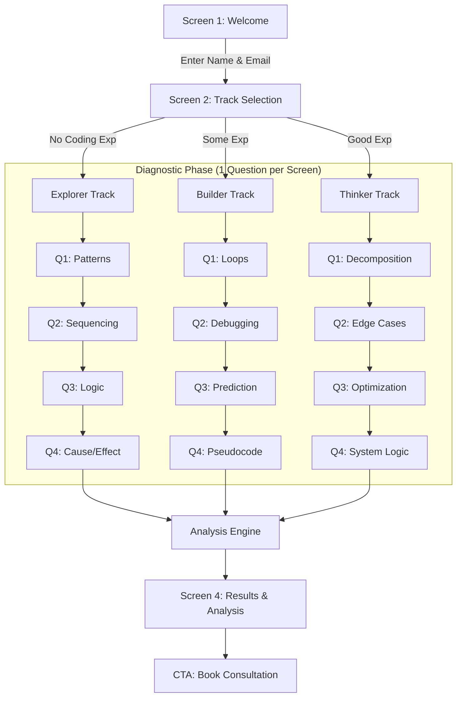

# EDVERA Pre-Diagnostic Assessment - Design Specification

## 1. Project Goal & Design Philosophy

**Goal**: Create a short (7–10 minute), calm, premium, and engaging diagnostic experience that assesses how students *think* rather than what they *know*.

**Core Philosophy**: 
*   **"Private Clinic, Not Mass EdTech"**: The user should feel like they are in a quiet, professional environment.
*   **"Understanding over Judgement"**: The result is a diagnosis of *thinking style*, avoiding terms like "fail" or "wrong".
*   **"Intellectual Dignity"**: No cartoons, gamification badges, or loud sounds.

## 2. UX Flow Diagram

## 3. UI Layout & Design Language

### Design Tokens
*   **Primary Color**: `Deep Navy (#0A192F)` - Ties to existing brand "Quiet Authority".
*   **Background**: `Off-white (#F9FAFB)` or `Soft Paper (#F5F5F7)`.
*   **Accent**: `Muted Gold (#C5A065)` or `Slate Blue (#64748B)`.
*   **Typography**: `Inter` or `Manrope` (Clean, legible, modern).
*   **Spacing**: Generous whitespace (`padding: 4rem`).
*   **Motion**: `0.4s ease-out` transitions. No bounce or elastic effects.

### Screen Breakdown

**Screen 1: Welcome (The Antechamber)**
*   **Center**: Elegant serif headline: *"Let's understand how you think."*
*   **Subtext**: *"A 7-minute assessment of your logic, reasoning, and pattern recognition. No preparation required."*
*   **Input**: Minimalist form for Name & Email (Underlined style, no boxy borders).
*   **Action**: "Begin Assessment" (Subtle button, hover lift).

**Screen 2: Track Selection (The Path)**
*   **Layout**: Three distinct, vertical cards.
*   **Visuals**: Abstract geometric icon for each (Circle, Square, Tesseract).
*   **content**:
    *   **Explorer**: "I am new to coding. I want to test my logic and problem-solving intuition."
    *   **Builder**: "I have written some code (Scratch/Python). I want to test my grasp of core concepts."
    *   **Thinker**: "I am experienced. I want to test my ability to design systems and solve complex problems."

**Screen 3: The Questions (The Clinic)**
*   **Header**: Minimal progress bar (thin line, gold fill).
*   **Center**: The Question. Large, clear text.
*   **Interaction**:
    *   **Multiple Choice**: Large, clickable tiles. subtle border highlight on selection.
    *   **Ordering**: Drag and drop lists (smooth physics).
    *   **Short Answer**: Clean text area (Thinker track).
*   **Footer**: "Next" button (appears valid only after interaction).

**Screen 4: Results (The Diagnosis)**
*   **Header**: *"Assessment Complete. Here is your cognitive profile, [Name]."*
*   **Visual**: A radar chart or simple bar chart showing attributes (Logic, Sequencing, Abstraction).
*   **Content**: 
    *   **Strengths**: "You show exceptional pattern recognition..."
    *   **Focus Areas**: "You tend to rush detailed sequencing..."
    *   **Recommended Path**: "We recommend the **Computer Science Rigour** track."
*   **CTA**: Sticky bottom bar or prominent card: *"Discuss this profile with a Senior Mentor."* -> Opens Booking Modal.

## 4. Sample Question Sets

### Track A: Explorer (Thinking Style: Intuitive Logic)
*Focus: Sequencing, Patterns, Instructions.*

1.  **The Pattern**: `Triangle, Square, Circle, Triangle, Square, [?]`.
    *   *Options*: Circle, Triangle, Square, Pentagon.
    *   *Tests*: Basic Pattern Recognition.
2.  **The Robot**: "A robot stands on a grid. It follows: 'Forward 2, Turn Right, Forward 1'. If it starts at (0,0) facing North, where is it?"
    *   *Options*: (1, 2), (2, 1), (1, 1).
    *   *Tests*: Spatial Reasoning / Sequencing.
3.  **The Sort**: "You have balls of size 5, 2, 8, 1. Arrange them from smallest to largest."
    *   *Interaction*: Drag and drop.
    *   *Tests*: Order magnitude processing.
4.  **Cause & Effect**: "If 'Switch A' turns on the Fan, and 'Switch B' turns on the Light, but 'Switch C' turns off everything. What happens if you press A, then B, then C?"
    *   *Options*: Needs detailed text options.
    *   *Tests*: State Management logic.

### Track B: Builder (Thinking Style: Algorithmic)
*Focus: Flow Control, Variables, Debugging.*

1.  **The Loop**: "We execute: `Repeat 3 times: Say 'Hello'`. How many times is 'Hello' said?"
    *   *Options*: 1, 3, 4, Infinite.
    *   *Tests*: Basic Iteration.
2.  **The Variable**: "`x = 5`. `x = x + 2`. `x = x * 2`. What is x?"
    *   *Options*: 14, 12, 10, 7.
    *   *Tests*: State/Variable tracking.
3.  **The Bug**: "Goal: Cross the road. Code: `Look Left -> Walk`. What is missing?"
    *   *Options*: Look Right, Stop, Run, nothing.
    *   *Tests*: Error detection / Safety constraints.
4.  **Pseudocode Logic**: "If `raining` is TRUE, take umbrella. Else, leave umbrella. It is NOT raining. Do you have the umbrella?"
    *   *Options*: Yes, No.
    *   *Tests*: Conditionals / Boolean logic.

### Track C: Thinker (Thinking Style: Systems & Architecture)
*Focus: Decomposition, Constraints, Optimization.*

1.  **Decomposition**: "You need to build a 'Elevator System' for a 100-floor building. What is the FIRST thing you need to decide?"
    *   *Options*: "The color of the buttons", "How many elevators vs. passenger logic", "The speed of the motor".
    *   *Tests*: Prioritization / System Architecture.
2.  **Edge Case**: "You are building a 'Login' form. Name one 'Edge Case' that might break the system."
    *   *Input*: Open text (short).
    *   *Tests*: Defensive thinking.
3.  **Optimization**: "You have 1000 playing cards. You need to find the 'Ace of Spades'. Which method is faster on average?"
    *   *A*: "Shuffle then look at top one."
    *   *B*: "Look at each card one by one."
    *   *C*: "Sort the cards, then simple search."
    *   *Tests*: Algorithmic efficiency intuition.
4.  **Debug Reason**: "A user reports a bug that 'sometimes' happens. What is your first step?"
    *   *Options*: "Rewrite the code", "Reproduce the bug reliably", "Tell them to refresh".
    *   *Tests*: Engineering mindset.

## 5. Scoring Logic

**Scoring Dimensions**:
1.  **Accuracy**: (Correct/Incorrect)
2.  **Speed** (Optional/Hidden): Extremely fast correct answers = High Intuition. Slow + Correct = Deliberate Thinker.
3.  **Completion**: Did they finish?

**Results Generation**:
*   **Result A (The Natural)**: 80%+ Correct.
    *   *Strengths*: "Rapid logic skills", "Strong pattern recognition".
    *   *Rec*: Accelerated Computer Science or Competitive Coding.
*   **Result B (The Methodical)**: 50-80% Correct.
    *   *Strengths*: "Careful thinker", "Good foundational grasp".
    *   *Rec*: Core Computer Science / Foundations Track.
*   **Result C (The Creative)**: <50% Correct (but finished).
    *   *Strengths*: "Persistent", "Creative approach".
    *   *Rec*: Visual Logic / Scratch (Start with confidence building).

## 6. Copy for Results Page

**Headline**: "Your Cognitive Blueprint"

**Intro**: 
*"Thank you, [Name]. We've analyzed your responses. You demonstrate a [Adjective: Logical / Creative / Methodical] approach to problem-solving."*

**Section: Strengths**
*"You excelled in **[Pattern Recognition]**, identifying sequences quickly. This suggests a natural aptitude for **[Algorithm Design]**."*

**Section: Growth Areas**
*"We noticed some hesitation in **[Linear Sequencing]**. At Edvera, we would focus on **[Structured Pseudocode]** exercises to build this mental muscle."*

**Section: Recommended Track**
**[The Builder Track: Logic & Computing]**
*"Based on your profile, we recommend starting here. It balances your natural intuition with the rigour of typed syntax."*

**CTA**:
*"This is just a computer's guess. A real conversation is better. Let's discuss this blueprint."*
[Button: Book Diagnostic Review (20 min)]

## 7. Implementation Suggestions

### Recommended: Custom Frontend (Vanilla JS)
Since you already have a high-quality `style.css` and a clean codebase, building this as a **Single Page Application (SPA)** within your existing site is the best "Premium" option.
*   **Tech**: HTML5, Vanilla JS (for state management of the quiz), CSS (reusing your variables).
*   **Why**: 
    1.  Zero load times (it's small).
    2.  Perfect visual consistency (fonts, colors clash if you use Typeform).
    3.  You keep the data 100% (No third-party data processing agreements needed).
    4.  transitions can be custom (e.g., "Quiet" fades).

### Alternative: No-Code
*   **Typeform**: Good for logic jumps, but "feels" like a survey, not an app. Hard to remove branding without high tier.
*   **Tally.so**: Cleaner, free-er, but still limited design control.
*   **Webflow**: Overkill if you just need a quiz.

**Verdict**: Build it in `diagnostic.html` linked to `assets/js/diagnostic.js`. I can scaffold this for you immediately.
